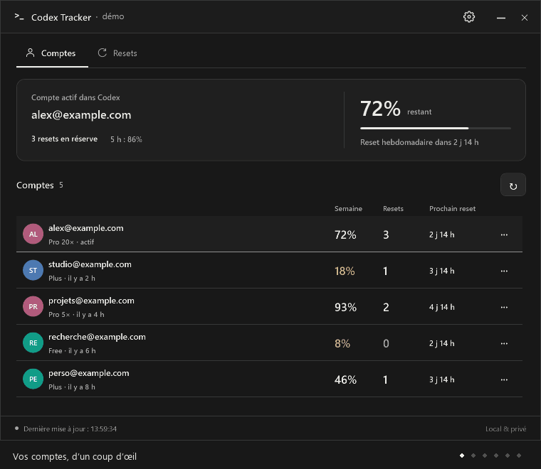

<h1 align="center">Codex Tracker</h1>
<p align="center">Vos quotas Codex, vos resets et vos rappels — dans la barre des tâches Windows.</p>
<p align="center"><a href="https://github.com/Aleqsd/codex-tracker/releases/download/v0.9.2/CodexTracker-0.9.2-Setup.exe"><strong>⬇ Télécharger pour Windows</strong></a> · <a href="https://github.com/Aleqsd/codex-tracker/releases">Toutes les versions</a></p>
<p align="center">Windows 11 · x64 · Gratuit · Données locales — nécessite Codex installé</p>
<p align="center"><sub>0.9.2 · version de stabilisation avant la 1.0</sub></p>


<p align="center"><sub>Démonstration avec des comptes fictifs. <a href="docs/resets-week.png">Aperçu statique</a></sub></p>

## Commencer en une minute

1. **Installez** le fichier `Setup.exe` ci-dessus. Aucun runtime ni droit administrateur à ajouter.
2. **Ouvrez Codex.** Le tracker détecte le compte connecté. Vos autres comptes apparaissent quand vous les utilisez dans Codex.
3. **Gardez l’icône dans la barre d’état.** Survolez-la pour un aperçu, cliquez pour ouvrir le tableau de bord.

Le bouton **flèche vers le coin**, à côté de **—**, masque le tracker dans la barre d’état et le retire de la barre des tâches. Le suivi continue.

## L’essentiel, en un coup d’œil

- **📊 Comptes** — quota hebdomadaire dans l’icône, offre, réserves et dernier relevé pour chaque compte.
- **📅 Resets** — agenda ou grille de la semaine, filtres par compte/type et réserve qui expire en premier.
- **🔔 Rappels** — notifications Windows avant un reset ou l’expiration d’une réserve, aux délais de votre choix.
- **🎨 À votre goût** — thème clair/sombre, noms et avatars personnalisés. Import des échéances dans Google Agenda.

## Bon à savoir

**Seul le compte actif dans Codex est actualisé**, toutes les deux minutes par défaut. Les autres conservent leur dernier relevé daté. Une date ou une valeur absente reste inconnue.

**Les rappels nécessitent un PC éveillé et le tracker ouvert.** Le démarrage avec Windows est facultatif. Aucun service distant n’est nécessaire pour les notifications Windows.

**Les options avancées restent facultatives.** Vous pouvez connecter vos propres comptes Twilio/SendGrid pour SMS, appels et emails, ou activer le [MCP local](docs/MCP.md) pour votre assistant. Ces options sont désactivées par défaut ; les frais éventuels dépendent de vos prestataires.

## Installer autrement ou aller plus loin

- **Sans installation :** prenez le ZIP portable dans les [Releases](https://github.com/Aleqsd/codex-tracker/releases). Le petit fichier `.sha256` sert aux mises à jour automatiques ; vous pouvez l’ignorer.
- **Mises à jour :** téléchargement automatique, puis bouton **Mettre à jour et relancer** ou installation au prochain démarrage. **Réglages → Application** permet aussi de recevoir les préversions ; seules les versions stables sont recherchées par défaut.
- **WinGet :** [publication soumise à Microsoft](docs/WINGET.md), identifiant prévu `Aleqsd.CodexTracker`.
- [Guide d’utilisation](docs/UTILISATION.md) · [Confidentialité](docs/PRIVACY.md) · [Signaler un problème](https://github.com/Aleqsd/codex-tracker/issues)

Un problème ? **Réglages → Application → Préparer un diagnostic** donne un aperçu sans comptes ni secrets, à copier dans votre signalement.

[Code signing policy](docs/CODE-SIGNING-POLICY.md) — intégration SignPath préparée, en attente d’acceptation. Les exécutables actuels ne sont pas encore signés.

<details>
<summary>Développer ou contribuer</summary>

.NET 10 / WPF. Consultez [AGENTS.md](AGENTS.md), l’[architecture](docs/ARCHITECTURE.md) et le [design](docs/DESIGN.md).

```powershell
./scripts/dev.ps1 -Action Check
./scripts/dev.ps1 -Action Demo
```

Les aperçus utilisent exclusivement des données fictives. Voir la [validation](docs/VALIDATION.md).

</details>

---

Projet indépendant, non affilié à OpenAI. Licence [MIT](LICENSE).
