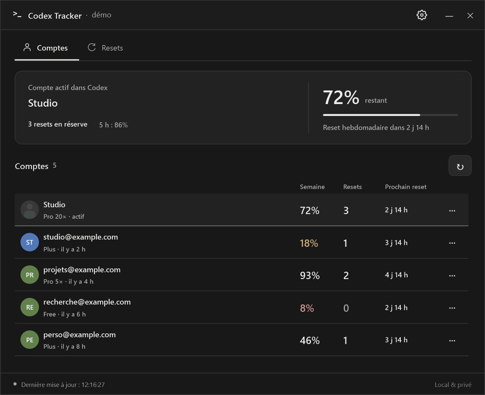
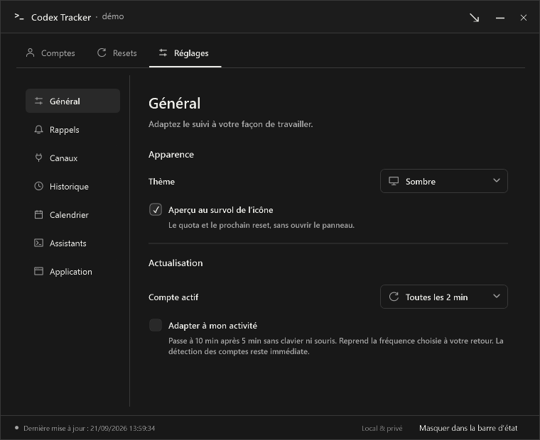
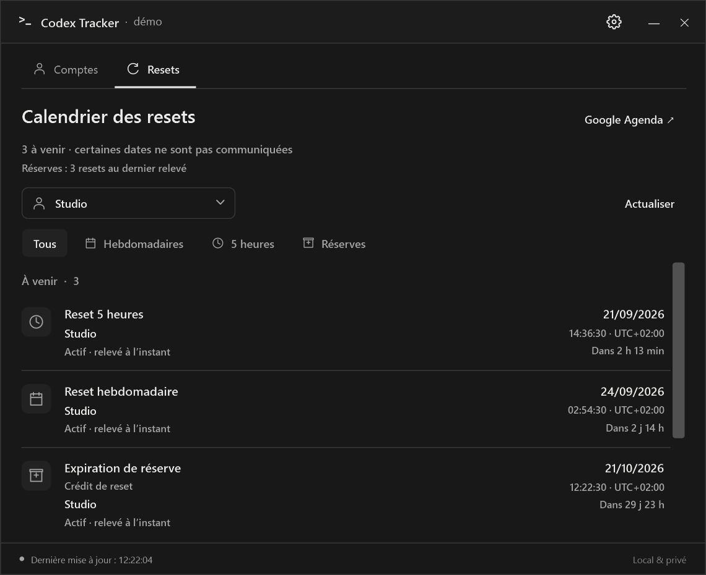

# Codex Tracker

Vos quotas Codex, directement dans la barre des tâches Windows.

L’icône affiche le **pourcentage hebdomadaire restant avec une fine jauge horizontale, sur fond transparent**. Survolez-la pour un aperçu ; cliquez pour retrouver vos comptes dans un panneau compact. Les dates précises, réserves, périodes d’abonnement et graphiques restent accessibles dans les détails.



## Installer

1. Téléchargez `CodexTracker-…-Setup.exe` depuis les [Releases](https://github.com/Aleqsd/codex-tracker/releases).
2. Lancez l’installateur : il installe l’application pour votre utilisateur, sans droits administrateur, et crée son raccourci. La désinstallation depuis les paramètres Windows conserve vos données de suivi.
3. Utilisez normalement Codex : le tracker détecte son compte ouvert. Chaque autre compte est ajouté automatiquement lorsque vous l’ouvrez dans Codex.
4. Dans les paramètres Windows de la barre des tâches, rendez l’icône Codex Tracker visible près de l’horloge.

Windows 11 x64 et une installation de Codex avec sa CLI `codex` sont nécessaires. Le runtime .NET est inclus. Le démarrage avec Windows est facultatif, depuis les réglages du tracker.

Une version portable ZIP est également disponible : extrayez-la dans un dossier permanent puis lancez `CodexTracker.exe`. Dans **Réglages → Mises à jour**, vous pouvez rechercher une version, la télécharger puis relancer le tracker. Le téléchargement utilise le dépôt public, vérifie l’empreinte SHA-256 et conserve une copie de secours jusqu’au démarrage réussi de la nouvelle version. Cette opération ne ferme pas Codex.

Le résultat de la recherche est conservé localement avec sa date. Les vérifications simultanées sont regroupées, et le bouton attend au moins cinq minutes après une vérification réussie. Si GitHub limite les requêtes, le tracker respecte le délai annoncé, même après redémarrage ; une erreur réseau déclenche aussi un délai progressif. Un ancien résultat reste explicitement présenté comme un cache, sans annoncer que l’application est à jour. Le lien **Voir les versions sur GitHub** reste accessible pour consulter la Release manuellement.

## Détection automatique

Changez de compte **dans Codex**. Le tracker observe son fichier de session en lecture seule, détecte le nouveau compte, sélectionne son quota dans l’icône et actualise ses données. Les changements de fichier sont surveillés immédiatement, avec un contrôle de secours toutes les deux secondes et une stabilisation de 300 ms. Une écriture transitoire ou une connexion réseau lente peut prolonger l’affichage des quotas.

Le bouton d’actualisation déclenche une vérification immédiate. Aucune connexion OAuth, bascule ni fermeture de Codex n’est effectuée par le tracker.

Seul le compte ouvert dans Codex est actualisé, toutes les deux minutes par défaut. Dans **Réglages → Actualisation**, choisissez 1, 2 ou 5 minutes. Le mode adaptatif, facultatif, passe à 10 minutes après 5 minutes sans activité clavier ou souris, puis reprend la fréquence choisie à votre retour. Les changements sont appliqués sans redémarrage ; si le dernier relevé dépasse déjà le délai choisi, une collecte démarre au prochain contrôle (environ une seconde). L’actualisation manuelle et la détection des changements de compte restent immédiates. Les autres comptes affichent leur **dernier relevé daté** ; leurs quotas peuvent avoir changé depuis. Ouvrez un compte dans Codex pour obtenir de nouvelles données. L’icône suit uniquement le compte actif détecté dans Codex. Sans compte actif, elle affiche une valeur indisponible ; aucun ancien relevé ne le remplace.

À la sortie de veille, le tracker abandonne les anciennes requêtes et relit l’identité active avant de collecter les quotas. Le premier relevé de reprise reste silencieux et redémarre la période d’observation utilisée pour les prévisions. Les fenêtres sont ramenées dans la zone utile après un changement d’affichage ; l’aperçu se recale selon le moniteur et son DPI. L’icône est réaffirmée après une recréation de la barre des tâches.

## Lire le tableau de bord

- La vue principale présente le compte actif puis une ligne par compte. Le compte actif reste automatiquement en tête ; les autres gardent un ordre stable. Le bouton **…** ouvre les détails et l’historique.
- Les thèmes clair et sombre suivent Windows, avec un choix manuel dans les réglages. Le dessin de l’icône s’adapte également au thème.
- **Hebdomadaire** : quota restant de la fenêtre de 10 080 minutes du bucket `codex`. Une limite de cinq heures n’est jamais présentée comme une limite hebdomadaire.
- **Dans l’icône** : chiffre monochrome lisible et jauge fine. La jauge reste neutre au-dessus de 20 %, orange entre 10 et 20 %, rouge sous 10 %. La valeur reste lisible sans dépendre uniquement de la couleur.
- **Offre** : badges Free, Plus, Pro et autres offres renvoyées par Codex. Les valeurs `prolite` et `pro` correspondent respectivement à Pro **5×** et Pro **20×**, conformément à l’interface Codex actuelle. Une offre inconnue reste affichée telle quelle.
- **Période d’abonnement** : début et fin de période active lorsqu’ils sont présents dans les métadonnées de session Codex. Ce ne sont pas nécessairement la date de souscription initiale ni une échéance de paiement. Les dates absentes restent indisponibles.
- **Resets en réserve** : compteur sans cadre sur le compte actif et dans la colonne **Resets**. Survolez le compteur pour lire les dates d’obtention et d’expiration, leur fuseau horaire et la date du relevé. L’aperçu de l’icône présente aussi la réserve et les expirations. Le compteur `availableCount` fourni par Codex, accompagné des expirations disponibles. Le nombre d’éléments détaillés ne remplace jamais le compteur serveur.
- Les dates précises utilisent le fuseau horaire Windows et son décalage UTC. Le compte à rebours complète l’heure exacte ; il ne confirme pas un reset tant que le serveur n’a pas actualisé la valeur.
- En cas d’erreur, les dernières valeurs et leur ancienneté sont conservées. Une information absente reste « indisponible », jamais zéro.

Le pied de fenêtre affiche **Dernière mise à jour : HH:mm:ss**, à partir du dernier relevé réussi du compte actif. La date apparaît aussi si le relevé précède aujourd’hui ; le survol donne la date complète et le fuseau. Un échec conserve cette heure et indique l’échec du dernier essai.

Les réglages sont répartis en quatre rubriques : **Général**, **Notifications**, **Calendrier** et **Application**. Les menus « Icône et libellé » associent une icône discrète à chaque réglage et affichent une coche sur la valeur choisie et restent utilisables au clavier.



## Onglet Resets

L’onglet **Resets**, à côté de **Comptes**, rassemble les échéances de tous les comptes dans une liste chronologique. Les catégories **Hebdomadaires**, **5 heures** et **Réserves** se combinent avec le filtre par compte. Chaque ligne met le type de reset en premier, avec son icône, puis le compte concerné ; les réserves affichent aussi le titre du crédit fourni par Codex. La date, l’heure exacte avec décalage UTC et le compte à rebours sont alignés à droite. Les dates de réception et l’ancienneté du relevé restent visibles ; le survol précise le fuseau et les informations reçues.

Les dates sont séparées en **À venir**, **Dates atteintes · à vérifier** et **Dates non communiquées**. Une date passée ne confirme pas un nouveau quota. Si le serveur fournit moins de dates de crédits que le compteur de réserves, une ligne signale les dates manquantes. Le total des réserves reste celui des derniers relevés, sans déduire la disponibilité depuis les dates.

**Google Agenda ↗** ouvre les options d’import pour le compte filtré, ou pour tous les comptes, en incluant tous les types de resets. **Actualiser** conserve les filtres et actualise uniquement le compte actif dans Codex.



## Personnalisation et calendrier

Cliquez directement sur **l’avatar d’un compte** (ou ouvrez **··· → Nom et avatar…**) pour choisir un nom court et une image PNG ou JPEG locale (8 Mo et 40 mégapixels maximum). L’image est recadrée au centre et copiée dans les données locales du tracker ; déplacer l’original ne change pas l’avatar. Les photos importées conservent leur transparence sur un fond neutre adapté au thème, sans initiales derrière l’image. Sans photo, un cercle coloré affiche les initiales du nom ou de l’adresse, avec une couleur stable par compte. Cliquez aussi sur cet avatar dans la fenêtre de personnalisation pour choisir une image. **Utiliser les initiales** retire la photo, et un nom vide rétablit l’adresse. Fermer la fenêtre abandonne les modifications non enregistrées. Les noms et les photos restent visibles. Le bouton de confidentialité et la sélection manuelle du compte de l’icône ont été retirés ; les anciens réglages correspondants sont ignorés.

**Réglages → Calendrier → Ouvrir les options Google Agenda…** présente un bouton principal **Importer dans Google Agenda**. Il prépare automatiquement un fichier `.ics` dans les données locales du tracker, ouvre la page d’import et affiche son chemin avec **Copier le chemin**. Dans Google, sélectionnez le fichier, choisissez l’agenda et confirmez **Importer**, conformément à [l’aide Google](https://support.google.com/calendar/answer/37118?hl=fr). Les clics répétés réutilisent le même fichier tant que les échéances n’ont pas changé. Les fichiers préparés restent sous `%LOCALAPPDATA%\CodexTracker\calendar-exports` ; le tracker ne les téléverse pas lui-même.

**Ajouter une seule échéance → Ajouter ↗** utilise le [lien officiel Google d’événement prérempli](https://developers.google.com/workspace/calendar/api/concepts/inviting-attendees-to-events#provide_a_link_for_users_to_add_the_event). La date, le titre et la description sont transmis à Google au clic ; vérifiez l’événement et cliquez sur **Enregistrer** dans le navigateur. Si Google demande une connexion, connectez-vous puis relancez le bouton. Le tracker ne peut pas confirmer que l’événement a été enregistré. L’import automatique par API requerrait une application OAuth et un accès en écriture à l’agenda ; cette version utilise les parcours du navigateur.

L’export classique **Exporter un fichier .ics…** reste disponible pour Google Agenda, Outlook ou Apple Calendar. Depuis les détails d’un compte, ces actions se limitent à ce compte. Seuls les prochains resets semaine/5 heures et les expirations connues sont inclus ; les événements durent cinq minutes et ne créent aucune récurrence. Les exports sont ponctuels et ne suivent pas les changements ultérieurs. Évitez les ajouts répétés ; les identifiants `.ics` restent stables pour une même échéance.

## Historique et notifications

Chaque compte conserve jusqu’à 90 jours de relevés locaux. Les graphiques proposent les dernières 24 heures ou les 7 derniers jours, pour la semaine ou la fenêtre de 5 heures. Les interruptions de collecte et changements de période coupent la courbe : aucune consommation n’est inventée pendant l’absence du compte. L’historique est disponible depuis la version 0.3 et reste conservé lors des mises à jour ; les périodes antérieures à son activation ne sont pas reconstituées.

Une estimation d’épuisement apparaît après au moins 15 minutes de relevés récents et continus, si leur évolution est suffisamment régulière. Elle indique la première fenêtre susceptible de s’épuiser, au rythme observé, avant son prochain reset. Un compte inactif, des données insuffisantes ou un rythme trop irrégulier restent sans estimation.

Les réglages permettent d’activer séparément les alertes **20 %, 10 % et 5 %**, ainsi que la notification de reset. Elles portent sur les fenêtres semaine et 5 heures. Les franchissements simultanés sont regroupés ; démarrage et changement de compte restent silencieux. Un reset est annoncé seulement après un relevé confirmant une nouvelle période et un quota remonté. Le simple compte à rebours ne déclenche rien.

Les **rappels d’expiration des réserves** sont activés par défaut, 24 heures avant l’échéance connue ; le délai est réglable à 3 ou 7 jours. Ils sont contrôlés chaque minute, regroupés par compte et mémorisés avant affichage pour ne pas se répéter après redémarrage. Une réserve inconnue, nulle ou déjà expirée ne déclenche rien. Les comptes inactifs peuvent produire un rappel basé sur leur dernier relevé daté : il faut vérifier la disponibilité du reset dans Codex. Les notifications affichent le nom personnalisé du compte, ou son adresse si aucun nom n’est défini.

Le bouton **Tester une notification** permet de vérifier leur affichage. Les paramètres de notifications et le mode de concentration de Windows s’appliquent.

## Aide au choix du compte

Une suggestion discrète apparaît sous le compte actif uniquement lorsqu’un de ses quotas est à 20 % ou moins et qu’un autre compte possède un relevé admissible. Elle indique **À vérifier dans Codex**, l’ancienneté du relevé et un bouton **Voir** ouvrant ses détails. Le changement de compte se fait toujours dans Codex.

Le conseil exige les deux quotas et leurs dates de reset, un relevé actif datant d’au plus cinq minutes et un relevé inactif datant d’au plus deux heures. Il écarte les erreurs, les données incohérentes et les resets déjà atteints. Parmi les comptes admissibles, il privilégie le relevé le plus récent. Il ne compare pas les capacités absolues de Free, Plus et Pro à partir de leurs pourcentages et ne suppose jamais qu’un compte a été rechargé. En l’absence de données suffisantes, aucune suggestion n’est affichée.

## Données locales

Les profils, réglages, avatars importés, historiques et derniers relevés sont stockés sous `%LOCALAPPDATA%\CodexTracker`, avec des permissions limitées à l’utilisateur Windows. Le tracker lit `%USERPROFILE%\.codex\auth.json` sans jamais le modifier. Il utilise uniquement le jeton d’accès courant en mémoire dans un processus Codex isolé avec un stockage de connexion `ephemeral` ; il ne conserve pas de session et ne renouvelle aucun jeton. Codex reste responsable de sa connexion. Si elle a expiré, ouvrez Codex pour la rétablir.

Les anciens coffres et sauvegardes de la version 0.1 ne sont ni utilisés ni modifiés lors de la mise à jour. Les métadonnées et derniers relevés sont conservés. Les nouveaux profils de travail temporaires sont nettoyés après collecte.

L’application ne possède pas de serveur de synchronisation et n’envoie pas vos comptes à ce dépôt. Les requêtes de quota passent par Codex et les services OpenAI ; les vérifications de mise à jour interrogent GitHub sans authentification. Aucun mot de passe n’est demandé au tracker. Les journaux applicatifs n’enregistrent pas de tokens. Les exemples et captures de ce dépôt utilisent uniquement des comptes fictifs.

Pour préconfigurer localement une première installation, créez `%LOCALAPPDATA%\CodexTracker\initial-accounts.json` avec un tableau d’adresses, par exemple `["demo@example.test"]`. Ce fichier est facultatif, lu uniquement si les réglages n’existent pas encore, et doit rester hors du dépôt. Ces comptes restent « À détecter » jusqu’à leur ouverture dans Codex.

## Développer

Installez le SDK .NET 10 puis, sous Windows :

```powershell
dotnet restore CodexTracker.slnx
dotnet build CodexTracker.slnx
dotnet test tests/CodexTracker.Tests/CodexTracker.Tests.csproj
dotnet run --project src/CodexTracker.App -- --demo
./scripts/publish.ps1
./scripts/build-installer.ps1 -InstallCompiler
```

Le dernier script peut installer le compilateur Inno Setup officiel pour l’utilisateur courant, après vérification de sa signature. La CI Windows compile la solution, lance les tests et produit le ZIP autonome ainsi que l’installateur.

La solution sépare `Core` (modèle et quotas), `Codex` (observation et protocole en lecture seule) et `App` (WPF et zone de notification). Les tests utilisent des sessions fictives et ne modifient jamais votre connexion Codex. Ils couvrent les réponses de quotas, valeurs absentes, dates et changements d’heure, changements de fichiers, isolation des comptes et réponses réseau tardives. Les contrôles réels et leurs limites sont détaillés dans [VALIDATION.md](docs/VALIDATION.md).

Pour quitter une instance existante avant une mise à jour : `CodexTracker.exe --exit`. Le mode démonstration se ferme séparément avec `CodexTracker.exe --demo --exit`.

Les captures automatisées sont réservées aux comptes fictifs : `CodexTracker.exe --demo --theme dark --screenshot dashboard.png --dpi 144 --smoke-test`. Les options `--demo-advice`, `--theme light`, `--peek-screenshot`, `--details-screenshot` et `--settings-screenshot` permettent de contrôler les autres états sans exporter les comptes réels.

## Références

[App Server Codex](https://learn.chatgpt.com/docs/app-server) · [Authentification Codex](https://learn.chatgpt.com/docs/auth) · [Offres Codex](https://learn.chatgpt.com/docs/pricing) · [Zone de notification Windows](https://learn.microsoft.com/en-us/windows/win32/shell/notification-area)

Projet indépendant, sans affiliation avec OpenAI. Licence MIT.
