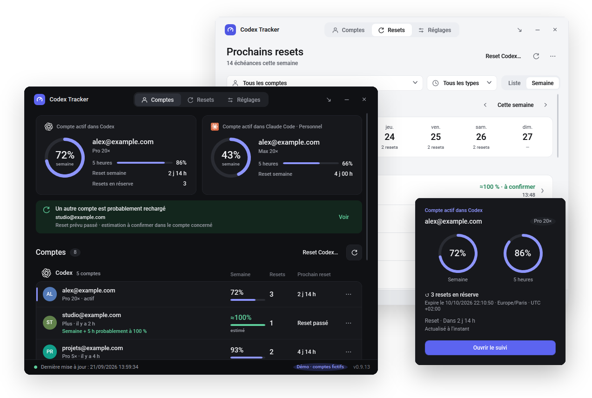
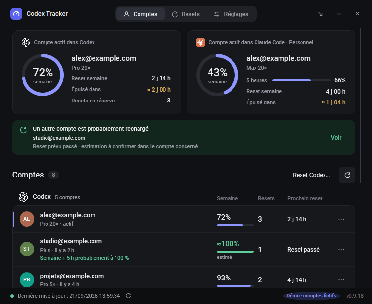
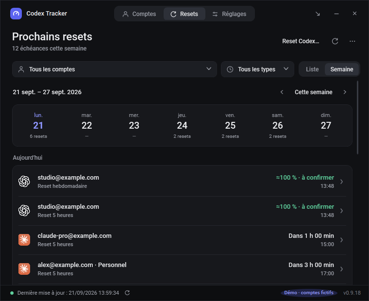
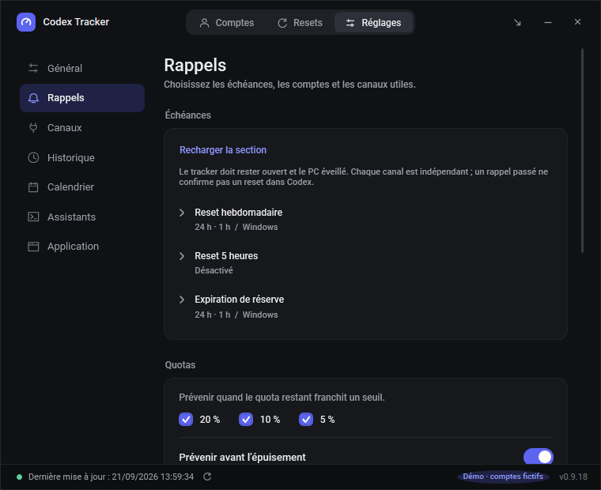
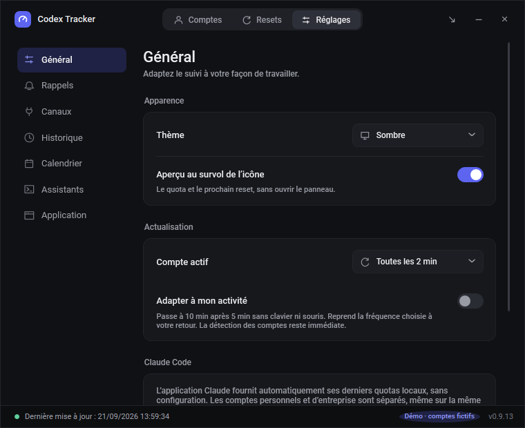
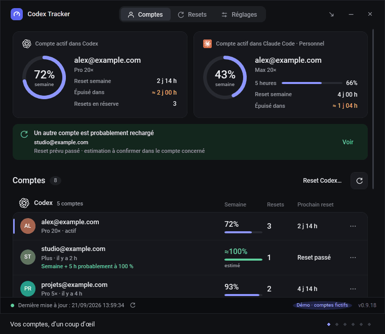

<h1 align="center">Codex Tracker</h1>
<p align="center"><strong>Sachez toujours combien il vous reste de Codex et de Claude Code.</strong><br>Votre quota, l’heure de la prochaine recharge et un rappel au bon moment, directement dans la barre des tâches Windows.</p>
<p align="center"><a href="https://github.com/Aleqsd/codex-tracker/releases/download/v0.9.16/CodexTracker-0.9.16-Setup.exe"><strong>⬇ Télécharger pour Windows</strong></a> · <a href="https://github.com/Aleqsd/codex-tracker/releases">Toutes les versions</a></p>
<p align="center"><sub>Gratuit · Windows 11 x64 · Sans compte ni serveur · Français ou English · Version 0.9.16</sub></p>

<p align="center"></p>

## En deux mots

Codex et Claude Code limitent votre usage : un quota sur **5 heures** et un autre sur **la semaine**. Une fois épuisé, il faut attendre qu’il se recharge, et rien ne vous dit clairement où vous en êtes.

Codex Tracker répond à trois questions, sans rien configurer :

- **Combien il me reste ?** Le pourcentage s’affiche dans l’icône de la barre des tâches. Survolez-la pour le détail.
- **Quand ça se recharge ?** L’heure exacte de chaque recharge, pour chaque compte, en liste ou sur la semaine.
- **Lequel de mes comptes utiliser ?** Tous vos comptes Codex et Claude Code côte à côte, personnels comme professionnels.

## Ce que vous obtenez

<table>
<tr>
<td width="50%" valign="top"><br><strong>Vos comptes d’un coup d’œil.</strong> Un anneau par compte actif, une barre pour chacun des autres et la date de leur dernier relevé.</td>
<td width="50%" valign="top"><br><strong>Le calendrier des recharges.</strong> Les prochaines recharges jour par jour, et les crédits de reset Codex en réserve avec leur date d’expiration.</td>
</tr>
<tr>
<td width="50%" valign="top"><br><strong>Prévenu au bon moment.</strong> Une notification Windows avant une recharge, sous 20, 10 ou 5 % de quota, une heure avant d’être à court au rythme actuel, ou quand un autre compte vient de se recharger. Un clic ouvre le suivi, ou « Rappeler » la représente plus tard.</td>
<td width="50%" valign="top"><br><strong>Discret et à votre goût.</strong> Interface en français ou en anglais, thème clair ou sombre comme Windows, noms et photos pour vos comptes, export vers Google Agenda.</td>
</tr>
</table>

<p align="center"><br><sub>Toutes les images utilisent des comptes fictifs.</sub></p>

## Installer en trois étapes

1. **Téléchargez et lancez** l’installateur ci-dessus. Pas de droits administrateur, rien d’autre à installer.
2. **Utilisez Codex ou Claude Code comme d’habitude.** Le compte connecté apparaît tout seul. Vos autres comptes s’ajoutent quand vous les ouvrez.
3. **Gardez l’icône visible** : glissez-la depuis la flèche ^ de la barre des tâches. Fermer la fenêtre la range simplement à côté de l’horloge ; le suivi continue.

Les mises à jour se téléchargent seules ; un bouton **Mettre à jour et relancer** apparaît quand une version est prête.

## Vos données restent chez vous

- **Rien à créer, rien à partager.** Pas d’inscription, pas de serveur : tout est enregistré sur votre PC.
- **Aucun mot de passe demandé.** Le tracker lit les quotas que Codex et Claude Code connaissent déjà. Il ne lit pas vos conversations et ne change jamais de compte à votre place.
- **Peu de connexions, et choisies.** Il recherche les mises à jour sur GitHub et, si vous le laissez faire, les annonces publiques de reset général. Les deux se désactivent dans les réglages.

Le détail est dans la [page confidentialité](docs/PRIVACY.md).

<details>
<summary><strong>Questions fréquentes</strong></summary>

**Pourquoi seul le compte ouvert est-il mis à jour ?**
Le tracker lit le compte actif dans Codex et dans Claude. Les autres gardent leur dernier relevé, toujours daté. Quand l’heure de recharge d’un compte inactif est passée, il l’affiche comme « probablement rechargé », à confirmer en ouvrant ce compte.

**Faut-il laisser l’application ouverte ?**
Pour les rappels, oui : elle reste discrète dans la barre des tâches et peut démarrer avec Windows. Le PC doit être allumé.

**Et Claude Code dans le terminal ?**
L’application Claude est détectée automatiquement. Pour le terminal, copiez le réglage proposé dans **Réglages → Général → Claude Code**. [Sources et limites](docs/CLAUDE-CODE.md).

**OpenAI a rechargé tous les quotas d’un coup ?**
Cliquez sur **Reset Codex…** et indiquez l’heure. Les comptes concernés affichent « 100 % · déclaré » jusqu’au prochain relevé réel. Les annonces publiques reconnues sont aussi signalées automatiquement ([fonctionnement](docs/GLOBAL-RESETS.md)).

**C’est payant ?**
Non. Seuls les SMS, appels et emails, facultatifs, passent par vos propres comptes Twilio ou SendGrid et suivent leurs tarifs.

</details>

## Pour aller plus loin

- **Sans installation** : le ZIP portable est dans les [versions publiées](https://github.com/Aleqsd/codex-tracker/releases). Son petit fichier `.sha256` sert aux mises à jour automatiques.
- **Assistants de code** : un [serveur MCP local](docs/MCP.md), désactivé par défaut, permet à votre assistant de consulter vos quotas.
- **WinGet** : [publication soumise à Microsoft](docs/WINGET.md), identifiant prévu `Aleqsd.CodexTracker`.
- [Guide d’utilisation complet](docs/UTILISATION.md) · [Signaler un problème](https://github.com/Aleqsd/codex-tracker/issues). **Réglages → Application → Préparer un diagnostic** produit un résumé sans compte ni secret à joindre à votre signalement.

[Code signing policy](docs/CODE-SIGNING-POLICY.md) : les exécutables actuels ne sont pas encore signés. Windows peut donc afficher un avertissement SmartScreen au premier lancement.

<details>
<summary>Développer ou contribuer</summary>

.NET 10 / WPF. Consultez [AGENTS.md](AGENTS.md), l’[architecture](docs/ARCHITECTURE.md) et le [design](docs/DESIGN.md).

```powershell
./scripts/dev.ps1 -Action Check
./scripts/dev.ps1 -Action Demo
```

Les aperçus utilisent exclusivement des données fictives. Voir la [validation](docs/VALIDATION.md).

</details>

---

<sub>Projet indépendant, non affilié à OpenAI ni à Anthropic. Codex et Claude sont des marques de leurs propriétaires respectifs. Licence [MIT](LICENSE).</sub>
