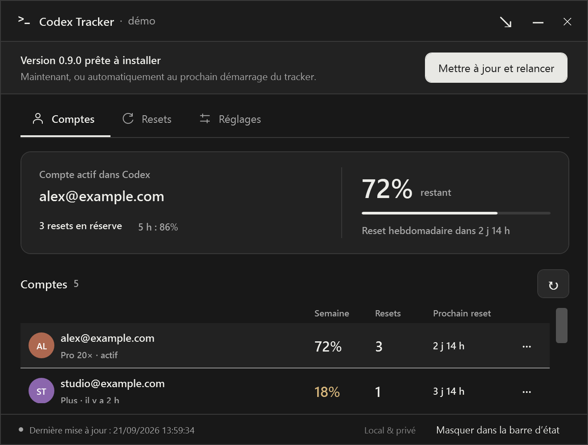

# Version 0.9.3 — resets probables des comptes inactifs

Les contrôles locaux couvrent l’instant exact du reset, les observations futures ou incohérentes, l’isolation des comptes et fenêtres, les dates absentes, les quotas invalides, les changements de fuseau, la fin de validité après une fenêtre, le rattrapage et l’absence d’envoi externe. Le journal est écrit avant transmission à Windows ; la répétition après redémarrage et l’annulation des reports après désactivation, suppression, changement de compte actif ou d’échéance sont testées avec un adaptateur simulé.

Les contrôles WPF vérifient les thèmes clair/sombre et fenêtres normale/compacte, le libellé explicite d’estimation, les détails datés, le défilement par **Voir**, le clavier et le retrait de l’estimation après un relevé. Les captures fictives sont produites à 96/144/192 DPI dans `artifacts/previews/expected-resets-*`. Elles ne remplacent pas un essai multi-écrans physique. Les données mesurées, historiques, conseils et pourcentage de l’icône restent inchangés.

# Échec de démarrage MCP — après la 0.9.2 publiée

Une connexion locale acceptée mais privée de son message initial reproduit le délai de 20 secondes sur l’exécutable publié 0.9.2 : le pont quittait avec le code 0, sans expliquer l’échec. Le correctif renvoie le code 1 et un message utile sur stderr, tout en conservant stdout vide. Une fermeture après connexion conserve le code 0.

Le candidat autonome corrigé passe la même reproduction en **20,2 secondes**, ainsi que les **14 contrôles du protocole MCP**, dont le démarrage à froid, deux clients simultanés, les conflits de révision et l’arrêt normal des deux ponts. `scripts/test-mcp-startup.ps1` utilise un canal nommé de démonstration unique et ne démarre ni collecteur ni envoi. Ce test rejoint les workflows de compilation et de préparation de signature. Il ne modifie pas l’installation 0.9.2 de l’utilisateur et n’est pas une nouvelle Release.

La [CI Windows sur `968b225`](https://github.com/Aleqsd/codex-tracker/actions/runs/35840768129) est entièrement réussie, y compris le délai MCP réel, le protocole publié, les tests métier/WPF et le cycle de l’installateur. Le correctif est prêt pour la prochaine version ; les fichiers de la Release 0.9.2 n’ont pas été remplacés.

# Préparation WinGet — 23 septembre 2026

Les trois manifestes de la [première soumission Microsoft](https://github.com/microsoft/winget-pkgs/pull/438574) ciblent maintenant la 0.9.2. Le Setup public a été téléchargé et comparé au fichier local : SHA-256 `2d0aaff5368b6a0adb4872a5320ac4384d0c807c1f5ceb200ab91b56cfd0951d`. `winget validate` réussit réellement. Aucune installation via manifeste local ni activation de `LocalManifestFiles` n’a été effectuée.

Le générateur lit désormais la version du projet par défaut et accepte le chemin du candidat signé. Il compare toujours les octets publics avant d’écrire les manifestes. Quatorze contrôles isolés passent avec téléchargement et validateur simulés : version et URL, trois fichiers, CRLF, empreinte, divergence du paquet public sans écrasement du manifeste existant, erreur réseau, checksum local invalide, version bêta refusée, chemin explicite sans checksum séparé et échec du validateur. Ces contrôles rejoignent les workflows Windows ; ils ne valent pas approbation Microsoft.

La [CI Windows sur `109410f`](https://github.com/Aleqsd/codex-tracker/actions/runs/35832082507) réussit : préparation WinGet, gardes de signature, tests métier et WPF, compilation autonome, protocole MCP et cycle de l’installateur. Aucun code de l’application installée n’a changé pour cette préparation ; les paquets publics 0.9.2 restent immuables.

Le contrôle NuGet `dotnet list CodexTracker.slnx package --vulnerable --include-transitive --format json`, exécuté le 23 septembre 2026 avec la source `https://api.nuget.org/v3/index.json`, ne signale aucune dépendance vulnérable pour les cinq projets. C’est un constat à cette date sur les avis connus, pas un audit complet du code ni une garantie sur de futurs avis.

# Préparation de signature — 23 septembre 2026

La [CI Windows](https://github.com/Aleqsd/codex-tracker/actions/runs/35827933069) et la [répétition complète du workflow de signature](https://github.com/Aleqsd/codex-tracker/actions/runs/35827933693) réussissent sur `9811e76`. Les contrôles couvrent les tests métier et WPF, les 28 gardes de signature, le protocole MCP sur le binaire autonome et le cycle de l’installateur avec données fictives conservées. L’empreinte de l’exécutable réellement installé est vérifiée contre celle du candidat.

Le [rapport conservé](validation/signing-rehearsal-2026-09-23.json) indique `mode: unsigned-rehearsal` et `signed: false`. Les étapes SignPath ont été volontairement ignorées ; ce succès ne valide pas leur acceptation par le service ni une signature réelle. Les fichiers de répétition n’ont pas remplacé les paquets publics et aucune donnée personnelle n’a été utilisée.

# Mise à niveau publique 0.9.1 → 0.9.2 — 23 septembre 2026

Les [deux parcours Windows isolés](https://github.com/Aleqsd/codex-tracker/actions/runs/35827491176) ont réussi avec les paquets déjà publiés et le canal **stable** : téléchargement automatique par l’application, contrôle du bouton visible et activé, installation par bouton ou au lancement suivant, correspondance du binaire final aux empreintes publiques et conservation des fichiers fictifs. Les instances ont quitté proprement. Les [rapports](validation/public-update-0.9.1-to-0.9.2.json) distinguent ces contrôles de l’observation humaine et des essais sur matériel physique.

# Version 0.9.2 — stockage Windows unifié, 23 septembre 2026

La disparition répétée est expliquée : un lancement depuis Codex héritait de la redirection MSIX d’AppData, tandis qu’un lancement depuis le bureau utilisait le dossier normal. Le chemin affiché par les variables d’environnement était identique. Le diagnostic a été confirmé par le chemin physique d’un fichier ouvert, puis par un lancement avec le contexte du bureau Windows. Les observations précédentes ci-dessous ne suffisaient donc pas à exclure ce défaut.

- [CI Windows du commit 6585b66](https://github.com/Aleqsd/codex-tracker/actions/runs/35825263224) verte : **396 tests métier**, suite WPF, **14 contrôles MCP** sur l’exécutable publié et cycle installation/réinstallation/désinstallation avec données fictives conservées.
- Treize régressions supplémentaires couvrent la fusion de cinq et deux profils fictifs, les dates et valeurs inconnues, les GUID différents ou en conflit, les historiques réattribués, les sources occupées ou endommagées, la reprise de migration et l’absence de résurrection après suppression volontaire.
- Installation locale réelle de `0.9.2+6585b66`, empreinte du binaire installé identique au paquet. Récupération des anciens comptes et vérification des lignes dans l’arbre d’accessibilité de la fenêtre réelle.
- Après fermeture puis lancement depuis l’environnement Codex affecté, le lanceur s’est terminé et le processus du tracker a démarré avec le contexte du bureau. Le stockage n’est plus redirigé, les comptes restent visibles et tous les anciens relevés sont conservés ou remplacés par une observation plus récente. Un seul processus principal reste ouvert.
- Données et captures personnelles exclues du dépôt. Aucun compte Codex changé, aucune reconnexion ni notification externe de test. Les copies privées d’origine et la sauvegarde de migration sont conservées.

Voir [le mécanisme de récupération et ses limites](STORAGE-RECOVERY.md). Ces contrôles ne constituent pas une campagne sur toutes les versions de Windows ou tous les environnements d’entreprise.

# Préparation de la 1.0 — 22 septembre 2026

- L’arbre d’accessibilité de l’application installée 0.9.1 expose le compteur de cinq comptes et leurs cinq lignes avec leurs derniers relevés. Aucun fichier privé n’a été modifié pour cette observation. La cause de l’affichage antérieur à deux comptes reste indéterminée ; aucun correctif de persistance n’est revendiqué.
- Deux nouvelles régressions vérifient cinq profils lors de deux redémarrages hors ligne, avec une session absente ou de format inconnu, une lecture de quota échouée, des changements de compte actif et une veille/reprise simulée. Les identités, observations, quotas et valeurs inconnues restent conservés. **383 tests métier passent**, compilation Release sans avertissement.
- Le test du fuseau tentait d’ouvrir un contrôle non chargé, situé sous la zone visible après expansion des formulaires. Il attend désormais la mise en page, défile jusqu’au contrôle et le focalise avant d’exiger une sélection visible et conservée. La suite WPF complète passe localement avec ce test renforcé ; les deux passages instrumentés n’ont pas reproduit l’échec initial. Aucun contrôle de production n’a été modifié.
- Les scripts de publication et la CI lisent la version dans `Directory.Build.props`, tout en conservant l’override explicite. Le compilateur Inno exige désormais cette version. Les cas par défaut, modification de la source, override et versions invalides passent avec des compilateurs simulés ; cela reste distinct de la compilation réelle.
- La recette de mise à jour publique accepte les versions numériques depuis 0.8.4, exige une cible plus récente et un choix explicite pour les préversions. Ses chemins correspondent aux fichiers réels du canal depuis 0.9.0. Quatre plans valides et trois couples invalides ont été vérifiés sans réseau ni modification du poste.
- Les [deux essais publics 0.9.0 → 0.9.1](https://github.com/Aleqsd/codex-tracker/actions/runs/35770993932) réussissent ensuite dans des profils Windows CI vierges avec le canal préversion activé explicitement : téléchargement automatique, paquet public vérifié, bouton visible/activé et invoqué pour le parcours Button, installation au lancement suivant pour Startup, exécutable attendu, processus réactif et données fictives conservées. Les [rapports](validation/public-update-0.9.0-to-0.9.1.json) distinguent cette preuve UI Automation d’une observation humaine.
- Une observation locale de 90,2 secondes de la 0.9.1, en dix échantillons, trouve un processus toujours réactif, 0,03 % de CPU moyen rapporté à tous les processeurs, 101,3 à 104,7 Mio de mémoire privée et un maximum de 215,9 Mio de mémoire résidente. Ce relevé court ne démontre ni stabilité sur une semaine ni absence de fuite mémoire.
- La [CI Windows sur `18a3ae8`](https://github.com/Aleqsd/codex-tracker/actions/runs/35772475460) valide compilation, 383 tests métier, suite WPF, paquet autonome, installateur et protocole MCP. Le [rapport du cycle d’installation](validation/installer-lifecycle-0.9.1.json) confirme l’installation par utilisateur, le premier lancement sans session Codex, une fenêtre visible appartenant au bon processus et un dispatcher réactif, puis l’arrêt propre. La réinstallation conserve les empreintes des trois fichiers fictifs ; la désinstallation retire les fichiers applicatifs et l’enregistrement Windows en conservant ces données. L’essai utilise un profil Windows Server CI vierge avec droits administrateur, pas un autre PC Windows 11 avec utilisateur standard.
- Les deux premiers essais de cette nouvelle recette s’arrêtaient à la recherche de fenêtre. Le diagnostic a établi que PowerShell convertissait `$null` en chaîne vide pour le paramètre de classe de `FindWindow`, empêchant toute correspondance. Le filtre nul est désormais fourni dans le code C# ; les conditions de visibilité, propriétaire, réponse et conservation sont maintenues. La correction de ce script n’est pas un changement du comportement de l’application.
- Les paquets embarquent maintenant les documents et rapports publics référencés par les guides, dont `AGENTS.md` et la préparation de la signature. Leur présence, leur contenu et le checksum du ZIP ont aussi été vérifiés dans un test ciblé avec compilateur simulé.

Les essais physiques, la semaine de bêta et la signature restent suivis dans [V1-READINESS.md](V1-READINESS.md). L’inspection réelle des comptes ne remplace pas une observation humaine de tous les parcours ; les tentatives d’interaction Computer Use ont été arrêtées après un échec de géométrie puis d’activation de la fenêtre.

# Version 0.9.1 — pied de page simplifié et profils conservés

Le correctif retire les libellés secondaires du pied de page (« Local & privé » et l’action de masquage). L’action reste disponible dans le bouton de la barre de titre. La [CI Windows du commit 444ef42](https://github.com/Aleqsd/codex-tracker/actions/runs/35749513811) valide les 381 tests métier, la suite WPF, l’installateur et le protocole MCP. Deux passages WPF locaux, avant correction du harnais de test, avaient échoué sur l’ouverture du sélecteur de fuseau horaire ; la suite complète passait sur Windows CI et passe désormais aussi localement après la correction décrite en tête de cette page. Le contrôle du pied de page a réussi dans les deux environnements.

L’installation réelle du binaire `0.9.1+444ef42` a réussi avec un code de sortie 0 et un exécutable identique à celui du paquet. Les cinq profils sont conservés, ainsi que les empreintes des préférences, secrets chiffrés et sept fichiers d’historique. Le processus relancé répond. La présence des données sur disque ne confirme pas à elle seule que toutes les lignes sont visibles dans l’interface. Les données privées restent hors du dépôt et des artefacts publics.

# Version 0.9.0 — stabilisation avant la 1.0

## Mise à jour entre Releases publiques — 22 septembre 2026

Les [deux essais Windows isolés](https://github.com/Aleqsd/codex-tracker/actions/runs/35721273263) du commit `d41286e` ont réussi avec les exécutables publics **0.8.4 → 0.9.0**, sans API simulée ni binaire recompilé :

- L’application a téléchargé elle-même la mise à jour. Le ZIP correspond au checksum public et l’EXE installé au contenu vérifié de ce ZIP.
- UI Automation a trouvé le bouton visible et activé. Un premier environnement a installé la mise à jour en invoquant ce bouton ; un second a quitté normalement puis installé automatiquement au lancement suivant.
- Dans les deux cas, le moteur a enregistré le succès, la nouvelle application répondait et les quatre fichiers fictifs — comptes, préférences, relevé et historique — ont gardé leurs empreintes. Les instances ont ensuite quitté proprement.

Les [rapports conservés](validation/public-update-0.8.4-to-0.9.0.json) ne contiennent que des résultats, dates, versions et empreintes publiques. Aucun compte personnel, identifiant ou envoi de notification externe. L’observation UI Automation reste distincte d’une observation humaine ; cet essai valide les binaires distribués sur Windows CI, pas un autre PC Windows 11 physique, un véritable démarrage Windows ou les nouveaux filtres de canaux de 0.9.0 à lui seul. La [recette reproductible](PUBLISHED-UPDATE-TEST.md) refuse les profils existants et s’arrête sans réessayer si GitHub limite les requêtes.

## Tests de stabilisation

- 381 tests métier réussis, dont les canaux stable/préversions, leur cache, les changements de canal pendant une préparation, la version Windows après installation, la récupération locale et les diagnostics de compatibilité.
- 123 contrôles WPF réussis : Réglages est un véritable troisième onglet, les sections et brouillons restent présents, le clavier et le défilement compact fonctionnent, les avertissements de récupération et l’aperçu du diagnostic restent accessibles. Les notifications Windows ne sont pas émises réellement par ces tests.
- Compilation Release sans avertissement. Revue croisée des canaux de mise à jour, de la récupération et de la durée de vie des réglages intégrés. Rendus fictifs Application compacts aux DPI 96/144/192, thèmes clair/sombre ; tour GIF régénéré avec les nouveaux onglets. Les rendus ne remplacent pas les essais entre écrans physiques.
- Le rapport de support exclut les noms de comptes, quotas, chemins et secrets. `CODEX_HOME` est pris en compte en lecture seule. Une corruption des préférences n’active ni rappels ni MCP ; un journal de rappels structurellement invalide suspend les envois sans empêcher le démarrage.

Les validations restant à terminer avant une version stable sont suivies dans [V1-READINESS.md](V1-READINESS.md), en distinguant les tests simulés des essais sur de vrais postes.

## Livraison 0.9.0

La [CI Windows du commit d1775ce](https://github.com/Aleqsd/codex-tracker/actions/runs/35704541790) est verte. La [Release 0.9.0](https://github.com/Aleqsd/codex-tracker/releases/tag/v0.9.0) contient exactement l’installateur, le ZIP et son checksum ; les trois empreintes GitHub correspondent aux fichiers locaux. Les 14 tests MCP de processus passent sur l’exécutable autonome.

Installation réelle depuis 0.8.4 : code de sortie 0, binaire identique à celui publié, version Windows 0.9.0, processus relancé et réactif. Profils, préférences, identifiants DPAPI et historiques conservés. Les fichiers EXE et Setup sont encore non signés.

L’essai initial de téléchargement automatique sur le poste local n’a pas pu être terminé : GitHub a imposé une limitation des recherches anonymes jusqu’au 22/09/2026 à 12:39:56, Europe/Paris. Ce délai a été respecté ; l’installation locale ci-dessus passe par Setup. Le parcours entre deux Releases publiques a ensuite été validé dans les deux environnements Windows isolés décrits en tête de cette page, sans déplacer ni modifier les comptes du poste local.

# Version 0.8.4 — diagnostic des notifications Windows

- Les deux boutons de test partagent le même moteur, un résultat visible et le journal. Une transmission ne devient plus un faux statut « affiché » ; absence d’adaptateur, journal illisible et exception sont signalés explicitement.
- 328 tests métier réussis, dont 23 nouveaux cas sur les états Windows, la transmission sans preuve d’affichage, les résultats persistés, les reports jusqu’à l’échéance, la déduplication et les exceptions sans contenu privé. 16 nouveaux contrôles WPF couvrent les deux pages, le clavier, le diagnostic compact, le double clic, le mode démo et les erreurs du runtime.
- La lecture native de `SHQueryUserNotificationState` a renvoyé `QUNS_BUSY` (application plein écran ou mode présentation) pendant l’investigation. Aucun réglage Windows n’a été modifié par le tracker. Les essais automatisés utilisent un adaptateur simulé ; l’utilisateur a ensuite confirmé l’apparition réelle de la notification sur la 0.8.4, puis avoir trouvé son réglage « Ne pas déranger ».
- Aperçus fictifs compacts clair/sombre inspectés à 150 %. Le bouton de réglages ouvre uniquement `ms-settings:notifications`.

# Version 0.8.3 — bouton de barre d’état

- Variante 03 appliquée : flèche diagonale vers le coin, placée entre Réglages et Réduire. Les libellés de l’action utilisent « barre d’état » dans la fenêtre, le pied de page, l’onboarding et l’installateur.
- Aperçu sombre compact inspecté ; 68 contrôles de personnalisation/actualisation/calendrier, 9 contrôles d’activation WPF et 14 contrôles MCP conservés.

# Version 0.8.2 — mises à jour et zone de notification

- 305 tests métier, dont 14 nouveaux cas : téléchargement partagé, préparation atomique, validation après redémarrage, mode hors ligne, annulation, horaires, anciennes préférences, anti-boucle et conservation du paquet précédent après un échec. La revue a aussi corrigé le nettoyage d’une préparation valide après un arrêt entre l’écriture du journal et le retrait du marqueur temporaire.
- Contrôles WPF du bandeau clair/sombre, du focus clavier, du téléchargement sans bouton prématuré, des deux préférences indépendantes et du masquage/restauration de la fenêtre sans entrée dans la barre des tâches. Aperçus fictifs en fenêtre compacte, 100 % et 200 % ; le mode `--demo-update` ne peut pas installer de mise à jour.
- Le helper existant conserve les tests de verrouillage, remplacement et restauration. Les tests de téléchargement et de lancement métier sont simulés : ils ne constituent pas une mise à jour réelle vers une future Release.
- Le test MCP sur l’exécutable autonome vérifie notamment la libération des deux processus clients lors de la fermeture du tracker. Aucun SMS, appel ou email réel.

# Correctif 0.8.1

Bouton **Réduire** lisible dans la barre d’état, en bas à droite. Le bouton supérieur reste disponible. Deux contrôles WPF supplémentaires vérifient sa visibilité et la réduction dans la barre des tâches : 291 tests métier, 73 contrôles WPF et 14 contrôles MCP réussis. Aperçus Comptes clair/sombre et compact, dont rendu compact à 200 % ; tour GIF actualisé avec données fictives.

La [CI du commit 84b7de1](https://github.com/Aleqsd/codex-tracker/actions/runs/35628091198) est verte. La [Release 0.8.1](https://github.com/Aleqsd/codex-tracker/releases/tag/v0.8.1) contient trois assets dont les empreintes GitHub correspondent aux fichiers locaux. Les 14 tests MCP passent sur le binaire autonome. Installation silencieuse réelle depuis 0.8.0 : code 0, binaire identique, profils/préférences/identifiants/historiques conservés, version Windows et raccourci vérifiés, processus relancé et réactif.

La [PR WinGet #438574](https://github.com/microsoft/winget-pkgs/pull/438574) pointe maintenant vers 0.8.1. Le CLA a été explicitement accepté par le contributeur, puis validé par Microsoft. Les contrôles techniques de 0.8.0 avaient réussi ; les contrôles du nouveau manifeste/binaire sont relancés. Cela ne constitue pas encore une publication dans le catalogue.

# Validation de la version 0.8.0

- 291 tests métier : ajout de 12 cas sur la semaine locale, les frontières d’année, les heures répétées et sautées, les valeurs inconnues, l’isolation des comptes et la réserve prioritaire. Aucune échéance récurrente n’est inventée.
- 71 contrôles WPF : ajout de la grille à sept jours, navigation, conservation des filtres/mode/semaine, dates manquantes, priorité et réduction/restauration dans la barre des tâches.
- 14 contrôles MCP de processus conservés, sans envoi externe réel.
- 24 rendus fictifs Agenda/Semaine × clair/sombre × normal/compact × DPI 96/144/192. Inspection des deux vues, dont Semaine compacte à 200 %. Les contenus longs défilent verticalement ; les noms tronqués ont un survol complet.
- Les tests de rendu du calendrier attendent sa mise en page ; les confirmations MCP attendent leur résultat avec un délai maximal, au lieu de dépendre d’une pause fixe de 400 ms.

La génération WinGet vérifie le checksum de l’installateur puis exécute la validation officielle des manifestes. La publication dans le catalogue dépend d’une revue externe. Le manifeste ne modifie pas les réglages de sécurité Windows pour autoriser son installation locale.

Ces rendus et contrôles WPF ne remplacent pas un essai sur plusieurs moniteurs physiques. Le mode MCP et les services de notifications restent inchangés.

## Livraison 0.8.0

La [CI Windows du commit 2c4e4f7](https://github.com/Aleqsd/codex-tracker/actions/runs/35623128160) est verte. La [Release 0.8.0](https://github.com/Aleqsd/codex-tracker/releases/tag/v0.8.0) contient l’installateur, le ZIP et son checksum ; les trois empreintes d’assets GitHub ont été comparées aux fichiers locaux. Les 14 contrôles MCP passent sur cet exécutable autonome.

L’installation réelle depuis la 0.7.0 s’est terminée avec le code 0. Le binaire installé correspond au binaire publié, les profils, préférences, identifiants DPAPI et fichiers d’historique ont été conservés. Le processus relancé répond ; version Windows et raccourci vérifiés. Aucun SMS, appel ou email de test réel.

`winget validate` réussit pour les trois manifestes. Le téléchargement public de l’installateur répond HTTP 200. La [soumission Microsoft #438574](https://github.com/microsoft/winget-pkgs/pull/438574) est distincte d’une acceptation/indexation. L’installateur silencieux a été testé directement ; `winget install --manifest` n’a pas été exécuté car LocalManifestFiles est désactivé sur ce PC.

## Base de validation 0.7.0

Contrôles ajoutés pour le MCP et les outils de contribution :

- 279 tests métier au total : révisions partagées, expansion des permissions, DPAPI, reçus persistants, expiration à cinq minutes, reprise sans réémission, annulation après attente dans la file d’envoi et verrouillage pendant une mise à jour.
- 64 contrôles WPF au total, dont 11 pour l’accès désactivé, le refus/fermeture et l’approbation des confirmations, l’annulation à la désactivation et le rendu des réglages Assistants en clair/sombre.
- 14 contrôles sur de vrais processus MCP stdio : négociation, 16 outils, lancement en arrière-plan, deux clients, révision périmée, déduplication, saisie en écriture seule et fermeture des ponts quand le tracker quitte. Le même script fonctionne sur l’exécutable autonome publié et dans la CI Windows.
- 36 captures de démonstration produites par la matrice d’aperçus. Vérification visuelle des vues Assistants et Resets en clair/sombre et petite fenêtre ; DPI de rendu 96/144/192.
- Aucun envoi réel SMS/appel/email. L’approbation de test dans les essais WPF utilise le runtime de démonstration qui bloque les envois.

Le client MCP de processus utilisé est un client de test JSON-RPC ; la validation n’affirme pas une installation dans tous les assistants tiers. Les tests de fermeture des ponts et de verrouillage du remplacement sont distincts d’une mise à jour téléchargée depuis une future release.

## Base de validation 0.6.0

Contrôles Windows 11 x64 du 21 septembre 2026, comptes fictifs uniquement dans les captures publiques.

- Compilation Release sans avertissement.
- 264 tests métier, dont 40 nouveaux cas de rappels : seuils exacts, indépendance des canaux/délais/comptes, identifiants des crédits, données absentes, migration, redémarrage, déduplication, reprise, annulation, heures silencieuses, changements d’heure Europe/Paris, quotas d’envoi, chiffrement DPAPI et journal corrompu.
- API Twilio/SendGrid simulées : contenu, authentification, SMS mono-segment, TwiML sans webhook, HTTP 401/429/500, réseau incertain, livraison et sérialisation des envois concurrents. Aucun SMS, appel ou email réel envoyé.
- 53 contrôles WPF : activation, navigation, règles par délai, champs secrets masqués, canaux désactivés en démonstration, fuseaux Windows/IANA, agenda, filtres, avatars et Google Agenda.
- Captures réelles du rendu WPF clair/sombre et petits formats ; rendu de l’agenda à 96, 144 et 192 DPI (100/150/200 %). Ces captures de rendu ne remplacent pas un déplacement manuel entre écrans de DPI différents.
- Les sorties de veille du moteur sont simulées par horloge injectable. La livraison réelle par les prestataires nécessite les identifiants de l’utilisateur et un test manuel volontaire ; elle n’est pas déclarée validée ici.

- Assistant Inno Setup personnalisé : compilation du mode moderne dynamique, inspection du véritable accueil sombre et de la page des options. Artwork original généré par `installer/GenerateArtwork.ps1`. Aucun écran d’installation fictif.

## Validations des versions précédentes

# Validation de la version 0.5.0

Contrôles effectués sur Windows 11 x64, les 20 et 21 septembre 2026. Les tests et captures publics utilisent uniquement des comptes fictifs.

| Contrôle | Résultat |
| --- | --- |
| Compilation Release, solution complète | Réussie, aucun avertissement |
| Tests automatisés | 212 réussis : quotas, dates, abonnement, observation, isolation, historique, prévisions, notifications, confidentialité, mises à jour, reprise et conseil de compte |
| Lecture réelle du compte Codex courant | Offre, multiplicateur, période active, quota hebdomadaire, date de reset et réserve reçus |
| Historique après collecte réelle | Premier point enregistré ; aucune prévision inventée à partir de ce seul point |
| Intégrité de la session active | Empreinte SHA-256 du cache inchangée avant/après la collecte |
| Persistance des credentials | Aucun fichier de session créé dans les données du tracker ; runtime temporaire nettoyé après collecte |
| Démonstration WPF | Vrais processus, captures fictives clair/sombre, personnalisation, détails et calendrier |
| Interactions WPF en démonstration | 21 contrôles dans la CI : activation depuis l’arrière-plan, avatars, noms persistants, annulation, options de fréquence, libellés, export calendrier et suppression des anciennes commandes de confidentialité/sélection |
| Rendus WPF 96, 144 et 192 DPI | Contrôle des dimensions et lisibilité ; ces rendus ne changent pas les réglages DPI de Windows |
| Icône transparente claire et sombre | Valeurs 0, 8, 10, 20, 21, 72, 99, 100 et inconnue aux tailles 16, 20, 24 et 32 pixels dans le [rendu de contrôle](tray-minimal.png) |
| Installateur Windows | Installation, mise à niveau et désinstallation réelles dans un dossier isolé ; arrêt gracieux de l’application de test et conservation du témoin de données privées |
| Mécanisme de mise à jour | Vrais exécutables de test autonomes utilisant le code de production : préparation, arrêt du parent, remplacement, contrôle de démarrage et restauration de l’ancien exécutable si le nouveau échoue |
| Limitation GitHub réelle | Réponse anonyme limitée : échéance serveur conservée ; deuxième essai et recréation du service ne produisent aucune nouvelle requête pendant ce délai |
| Comportements Windows | 17 tests de placement et 13 contrôles sur de vrais HWND, décrits ci-dessous |

## Ajouts de la version 0.5.6

- L’encart du compte actif adopte la disposition « Deux zones » : identité et réserves à gauche, quota hebdomadaire, jauge et prochain reset à droite, séparés par un filet discret.
- L’onglet Resets met le type en premier, avec une icône distincte, le titre des crédits et les dates/heures alignées. Filtres Hebdomadaires, 5 heures et Réserves combinables avec le compte ; ils restent sélectionnés après actualisation.
- Compilation sans avertissement et 50 contrôles WPF réussis, dont les filtres combinés, les réserves sans date et la sélection vide. Captures clair/sombre inspectées à 760 × 620 et 630 × 500, avec une adresse fictive longue ; dates des réserves et du prochain reset conservées au survol.

## Ajouts de la version 0.5.5

- 224 tests métier et 45 contrôles WPF réussis. Les ajouts couvrent le tri des échéances, les dates absentes ou partielles, l’isolation par compte, les réserves inconnues ou nulles et les dates historiques conservées.
- Navigation réelle Comptes → Resets → Comptes, libellé du filtre, conservation après actualisation, export du compte filtré et affichage des échéances atteintes sans annoncer un quota rétabli.
- Captures WPF avec comptes fictifs inspectées en clair/sombre, aux dimensions 760 × 620 et 630 × 500, rendues à 150 %. Les listes défilent sans rogner les dates.
- Un contrôle préexistant du calendrier a échoué ponctuellement en recherchant le bouton d’un panneau venant de s’ouvrir ; une seconde exécution inchangée de ce contrôle a réussi. Aucun événement Google réel n’a été créé.

## Ajouts de la version 0.5.4

- 215 tests métier et 37 contrôles WPF réussis. Les liens Google conservent les instants UTC lors du changement d’heure et encodent les caractères spéciaux sans ajouter de paramètres.
- Le clic d’import prépare un vrai fichier local avant l’ouverture du navigateur simulée ; les tests couvrent la réutilisation, le brouillon individuel, le refus d’une échéance périmée et l’échec du navigateur sans perte du fichier.
- Captures WPF clair/sombre inspectées. Le lien Google documenté a été ouvert avec un événement fictif dans un navigateur sans session Google, qui a affiché la page de connexion/présentation du service. Aucun événement n’a été ajouté à un agenda réel ; le formulaire connecté et l’import final restent à vérifier par l’utilisateur.

## Ajouts de la version 0.5.3

- 32 contrôles WPF réussis. Deux tests supplémentaires rendent un PNG transparent dans le tableau de bord et dans l’aperçu, en thèmes sombre et clair : le pixel central correspond au fond neutre du thème et les initiales sont absentes.

## Ajouts de la version 0.5.1

- 30 contrôles WPF réussis : 23 contrôles fonctionnels et 7 de réouverture. Les ajouts vérifient la navigation des réglages, les libellés et la coche du menu ouvert, l’ouverture par clic sur avatar, les initiales et leur aperçu, la couleur stable, ainsi que l’heure du relevé conservée après un échec.
- Rendu WPF inspecté en thèmes clair et sombre avec des comptes fictifs. Les captures à 150 % ne remplacent pas un changement de DPI physique.

## Ajouts de la version 0.5

- 212 tests métier réussis, dont la persistance des noms, l’isolation, les valeurs par défaut, le retour de la fréquence adaptative, les changements de fréquence dans le collecteur réel, les rappels d’expiration avec déduplication persistante et l’export calendrier.
- 14 nouveaux contrôles WPF : copie et recadrage d’image, nom et photo après redémarrage, suppression de l’original, isolation des comptes, annulation, prise en compte des anciens réglages désactivés, saisie des options, export réel `.ics`, étape Google, suivi du compte actif et rejet d’image invalide. Les 7 contrôles WPF de réouverture depuis l’arrière-plan passent également.
- L’export couvre les deux occurrences de 02:30 lors du passage à l’heure d’hiver, l’échappement des caractères et retours à la ligne, le pliage UTF-8 à 75 octets et les dates absentes/passées. L’import Google suit le parcours documenté ; aucun événement n’a été ajouté à un agenda réel pendant la validation.
- Le mode adaptatif se base sur l’inactivité clavier/souris Windows. Les durées sont simulées dans les tests ; aucun réglage de veille Windows n’est modifié.

## Vérifications Windows de la version 0.4

L’environnement disponible comporte un écran 2880 × 1800 à 200 %, avec une zone utile de 2880 × 1704 pixels physiques. Les fenêtres principale et Réglages, déplacées volontairement hors écran, sont récupérées après des messages `WM_DISPLAYCHANGE` et `SPI_SETWORKAREA` adressés uniquement à la démonstration.

L’icône de cette seule démonstration a été retirée avec `Shell_NotifyIcon(NIM_DELETE)`. Son absence, puis son retour avec la même identité après des messages ciblés `TaskbarCreated`, ont été vérifiés avec `Shell_NotifyIconGetRect`. Explorer n’a pas été redémarré. Le traitement natif de [NotifyIcon .NET 10](https://github.com/dotnet/winforms/blob/v10.0.0/src/System.Windows.Forms/System/Windows/Forms/NotifyIcon.cs) est complété par une réaffirmation différée de l’icône.

Les gestionnaires de veille/reprise de l’application ont été invoqués dans la démonstration ; aucune mise en veille du PC n’a été déclenchée. Les tests du collecteur couvrent l’abandon des réponses commencées avant la suspension, une identité modifiée pendant la pause, le silence des notifications à la reprise et les événements survenant avant l’initialisation. Après 80 cycles de menus et d’aperçu, le nombre de ressources GDI est resté stable (38).

Les origines négatives de moniteur, les DPI 96/144/192, les barres sur les quatre côtés, les petites zones utiles et la disparition d’un écran sont couverts par les tests de géométrie. Ces tests ne remplacent pas une manipulation de plusieurs écrans physiques.

## Couverture des tests

Les tests de collecte couvrent les changements A → B → A, une détection pendant une requête lente, le rejet d’une réponse tardive, le refus des données d’un autre compte, la disparition et le remplacement atomique de la session, la recréation du dossier et la conservation des derniers relevés. Un test garde le fichier de session ouvert en refusant toute écriture.

Les dates d’abonnement proviennent exclusivement des champs de période active de l’ID-token, jamais de la date d’émission ou d’expiration du jeton. Les valeurs absentes restent inconnues. Le mapping Pro 5×/20× a été comparé à l’interface Codex installée et à sa documentation d’offres.

Les tests d’historique vérifient la rétention de 90 jours, le regroupement des relevés, les frontières de reset, la séparation des comptes et les réponses obsolètes. Les prévisions refusent les périodes trop courtes, anciennes ou irrégulières, les interruptions et un épuisement situé après le prochain reset. Les notifications couvrent les trois seuils indépendants, la déduplication persistante, les resets confirmés et le silence au démarrage ou lors d’un changement de compte.

Les tests de mise à jour couvrent les versions, les réponses GitHub, les limites de téléchargement, les redirections, les empreintes, les archives malformées et les chemins interdits, ainsi que l’installation et la restauration. Le cache et les délais couvrent également ETag/304, la pagination, la corruption locale, les réponses trop volumineuses, le regroupement des requêtes et l’annulation d’un seul appelant. Les essais avec de vrais processus réalisés en 0.3 restent applicables au mécanisme d’installation inchangé : ils utilisent un dossier isolé, un téléchargement simulé et des versions de test. Ils ne remplacent pas une mise à jour depuis une future Release publique. La consultation sans authentification peut être temporairement limitée par GitHub ; le tracker affiche la date du cache et la prochaine vérification autorisée selon les [consignes GitHub](https://docs.github.com/en/rest/using-the-rest-api/best-practices-for-using-the-rest-api).

Le conseil de compte possède 28 tests couvrant les seuils, la fraîcheur au tick près, les valeurs absentes, les identités contradictoires, les erreurs, les resets non confirmés, les décalages horaires et les changements d’heure. Aucune capacité absolue n’est déduite d’un pourcentage ou d’une offre.

## Contrôles interactifs restants

- Effectuer un changement réel entre deux comptes dans Codex. La lecture du compte courant est réelle ; les transitions entre identités ont été testées avec des fichiers fictifs, sans modifier la connexion de l’utilisateur.
- Vérifier plusieurs écrans physiques, un vrai changement d’échelle Windows, une sortie de veille, le survol dans les différentes configurations de barre des tâches et le rétablissement de l’icône après redémarrage d’Explorer.
- Confirmer la réception des notifications sur la configuration personnelle de Windows, notamment avec le mode de concentration activé.

Le tracker ne propose ni connexion OAuth ni bascule de compte. Il ne ferme pas Codex. Les anciens essais de bascule de la version 0.1 ne s’appliquent pas à cette version.

## Réouverture après démarrage en arrière-plan (0.4.2)

Le scénario fautif est reproduit avec une vraie fenêtre WPF et des données fictives : un appel natif ShowWindow affiche le HWND sans créer son contenu WPF. La nouvelle demande de réouverture est traitée par le dispatcher de l’instance active, qui appelle ShowPanel et Window.Show.

Sept contrôles automatisés couvrent le démarrage masqué, la reproduction du contenu absent, la première ouverture, la réouverture après masquage, la restauration après réduction, les ouvertures répétées et une demande pendant la fermeture. Ils vérifient la présence effective des contrôles visibles, et pas seulement le titre ou la réactivité du processus. Ce programme est exécuté par la CI Windows.
